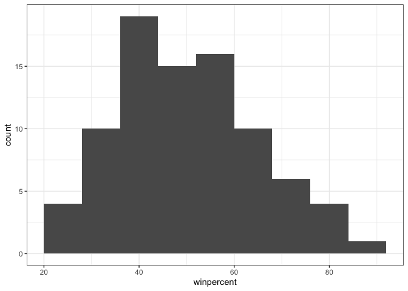
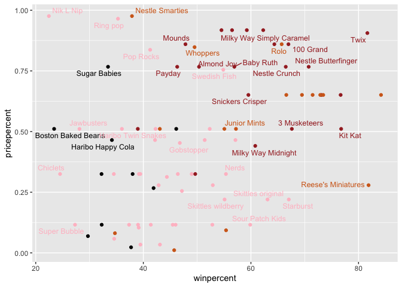
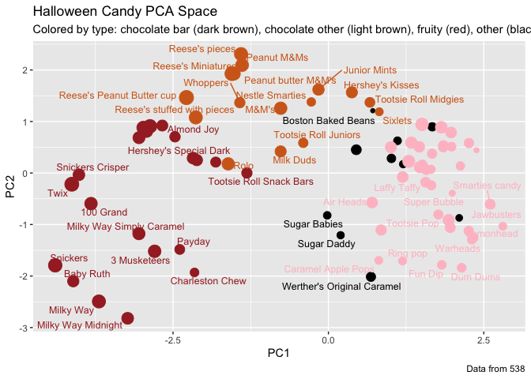

# Class09
Yuxuan Jiang A17324184

- [Importing candy data](#importing-candy-data)
  - [What is in the dataset?](#what-is-in-the-dataset)
  - [What is your favorite candy?](#what-is-your-favorite-candy)
- [Exploratory analysis](#exploratory-analysis)
- [Overall Candy Rankings](#overall-candy-rankings)
  - [Time to add some useful color](#time-to-add-some-useful-color)
- [Taking a look at pricepercent](#taking-a-look-at-pricepercent)
- [Exploring the correlation
  structure](#exploring-the-correlation-structure)
- [Principal Component Analysis](#principal-component-analysis)
- [Summary](#summary)

## Importing candy data

``` r
candy_file <- read.csv("candy-data.csv",row.names=1)
candy = data.frame(candy_file)
head(candy)
```

                 chocolate fruity caramel peanutyalmondy nougat crispedricewafer
    100 Grand            1      0       1              0      0                1
    3 Musketeers         1      0       0              0      1                0
    One dime             0      0       0              0      0                0
    One quarter          0      0       0              0      0                0
    Air Heads            0      1       0              0      0                0
    Almond Joy           1      0       0              1      0                0
                 hard bar pluribus sugarpercent pricepercent winpercent
    100 Grand       0   1        0        0.732        0.860   66.97173
    3 Musketeers    0   1        0        0.604        0.511   67.60294
    One dime        0   0        0        0.011        0.116   32.26109
    One quarter     0   0        0        0.011        0.511   46.11650
    Air Heads       0   0        0        0.906        0.511   52.34146
    Almond Joy      0   1        0        0.465        0.767   50.34755

### What is in the dataset?

> Q1. How many different candy types are in this dataset?

``` r
num.candy.types <- ncol(candy)
num.candy.types
```

    [1] 12

> Q2. How many fruity candy types are in the dataset?

``` r
num.fruity <- sum(candy$fruity)
num.fruity
```

    [1] 38

### What is your favorite candy?

> Q3.What is your favorite candy (other than Twix) in the dataset and
> what is it’s winpercent value?

``` r
library(dplyr)
```


    Attaching package: 'dplyr'

    The following objects are masked from 'package:stats':

        filter, lag

    The following objects are masked from 'package:base':

        intersect, setdiff, setequal, union

``` r
candy |>
  filter(row.names(candy)=="Air Heads") |>
  select(winpercent)
```

              winpercent
    Air Heads   52.34146

> Q4. What is the winpercent value for “Kit Kat”?

``` r
library(dplyr)

candy |>
  filter(row.names(candy)=="Kit Kat") |>
  select(winpercent)
```

            winpercent
    Kit Kat    76.7686

> Q5. What is the winpercent value for “Tootsie Roll Snack Bars”?

``` r
library(dplyr)
candy |>
  filter(row.names(candy)=="Tootsie Roll Snack Bars")|>
  select(winpercent)
```

                            winpercent
    Tootsie Roll Snack Bars    49.6535

> Q6. Is there any variable/column that looks to be on a different scale
> to the majority of the other columns in the dataset?

``` r
library(skimr)
skim(candy)
```

|                                                  |       |
|:-------------------------------------------------|:------|
| Name                                             | candy |
| Number of rows                                   | 85    |
| Number of columns                                | 12    |
| \_\_\_\_\_\_\_\_\_\_\_\_\_\_\_\_\_\_\_\_\_\_\_   |       |
| Column type frequency:                           |       |
| numeric                                          | 12    |
| \_\_\_\_\_\_\_\_\_\_\_\_\_\_\_\_\_\_\_\_\_\_\_\_ |       |
| Group variables                                  | None  |

Data summary

**Variable type: numeric**

| skim_variable | n_missing | complete_rate | mean | sd | p0 | p25 | p50 | p75 | p100 | hist |
|:---|---:|---:|---:|---:|---:|---:|---:|---:|---:|:---|
| chocolate | 0 | 1 | 0.44 | 0.50 | 0.00 | 0.00 | 0.00 | 1.00 | 1.00 | ▇▁▁▁▆ |
| fruity | 0 | 1 | 0.45 | 0.50 | 0.00 | 0.00 | 0.00 | 1.00 | 1.00 | ▇▁▁▁▆ |
| caramel | 0 | 1 | 0.16 | 0.37 | 0.00 | 0.00 | 0.00 | 0.00 | 1.00 | ▇▁▁▁▂ |
| peanutyalmondy | 0 | 1 | 0.16 | 0.37 | 0.00 | 0.00 | 0.00 | 0.00 | 1.00 | ▇▁▁▁▂ |
| nougat | 0 | 1 | 0.08 | 0.28 | 0.00 | 0.00 | 0.00 | 0.00 | 1.00 | ▇▁▁▁▁ |
| crispedricewafer | 0 | 1 | 0.08 | 0.28 | 0.00 | 0.00 | 0.00 | 0.00 | 1.00 | ▇▁▁▁▁ |
| hard | 0 | 1 | 0.18 | 0.38 | 0.00 | 0.00 | 0.00 | 0.00 | 1.00 | ▇▁▁▁▂ |
| bar | 0 | 1 | 0.25 | 0.43 | 0.00 | 0.00 | 0.00 | 0.00 | 1.00 | ▇▁▁▁▂ |
| pluribus | 0 | 1 | 0.52 | 0.50 | 0.00 | 0.00 | 1.00 | 1.00 | 1.00 | ▇▁▁▁▇ |
| sugarpercent | 0 | 1 | 0.48 | 0.28 | 0.01 | 0.22 | 0.47 | 0.73 | 0.99 | ▇▇▇▇▆ |
| pricepercent | 0 | 1 | 0.47 | 0.29 | 0.01 | 0.26 | 0.47 | 0.65 | 0.98 | ▇▇▇▇▆ |
| winpercent | 0 | 1 | 50.32 | 14.71 | 22.45 | 39.14 | 47.83 | 59.86 | 84.18 | ▃▇▆▅▂ |

Yes, the `winpercent`.

> Q7. What do you think a zero and one represent for the
> candy\$chocolate column?

O in missing value means that there is no missing value in `chocolate`.
1 means that all the rows in `chocolate` has a value.

## Exploratory analysis

> Q8. Plot a histogram of winpercent values

``` r
library(ggplot2)
ggplot(candy)+
  aes(winpercent)+
  geom_histogram(binwidth = 8)+
  theme_bw()
```



> Q9. Is the distribution of winpercent values symmetrical?

The distribution of winpercent is not symmetrical and it is right
skewed.

> Q10. Is the center of the distribution above or below 50%?

``` r
summary(candy$winpercent)
```

       Min. 1st Qu.  Median    Mean 3rd Qu.    Max. 
      22.45   39.14   47.83   50.32   59.86   84.18 

Based on the median, the the center of the distribution is below 50%.

> Q11. On average is chocolate candy higher or lower ranked than fruit
> candy?

``` r
choc.candy <- candy[candy$chocolate==1,]
choc.win <- choc.candy$winpercent
summary(choc.win)
```

       Min. 1st Qu.  Median    Mean 3rd Qu.    Max. 
      34.72   50.35   60.80   60.92   70.74   84.18 

``` r
fruity.candy <- candy[candy$fruity==1,]
fruity.win <- fruity.candy$winpercent
summary(fruity.win)
```

       Min. 1st Qu.  Median    Mean 3rd Qu.    Max. 
      22.45   39.04   42.97   44.12   52.11   67.04 

As the mean of chocolate winpercent is higher,on average chocolate candy
is higher ranked than fruity candy.

> Q12. Is this difference statistically significant?

``` r
t.result <- t.test(choc.win,fruity.win)
t.result
```


        Welch Two Sample t-test

    data:  choc.win and fruity.win
    t = 6.2582, df = 68.882, p-value = 2.871e-08
    alternative hypothesis: true difference in means is not equal to 0
    95 percent confidence interval:
     11.44563 22.15795
    sample estimates:
    mean of x mean of y 
     60.92153  44.11974 

Since p\<0.05, this difference is statistically significant.

## Overall Candy Rankings

> Q13. What are the five least liked candy types in this set?

``` r
head(candy[order(candy$winpercent),],n=5)
```

                       chocolate fruity caramel peanutyalmondy nougat
    Nik L Nip                  0      1       0              0      0
    Boston Baked Beans         0      0       0              1      0
    Chiclets                   0      1       0              0      0
    Super Bubble               0      1       0              0      0
    Jawbusters                 0      1       0              0      0
                       crispedricewafer hard bar pluribus sugarpercent pricepercent
    Nik L Nip                         0    0   0        1        0.197        0.976
    Boston Baked Beans                0    0   0        1        0.313        0.511
    Chiclets                          0    0   0        1        0.046        0.325
    Super Bubble                      0    0   0        0        0.162        0.116
    Jawbusters                        0    1   0        1        0.093        0.511
                       winpercent
    Nik L Nip            22.44534
    Boston Baked Beans   23.41782
    Chiclets             24.52499
    Super Bubble         27.30386
    Jawbusters           28.12744

> Q14. What are the top 5 all time favorite candy types out of this set?

``` r
tail(candy[order(candy$winpercent),],n=5)
```

                              chocolate fruity caramel peanutyalmondy nougat
    Snickers                          1      0       1              1      1
    Kit Kat                           1      0       0              0      0
    Twix                              1      0       1              0      0
    Reese's Miniatures                1      0       0              1      0
    Reese's Peanut Butter cup         1      0       0              1      0
                              crispedricewafer hard bar pluribus sugarpercent
    Snickers                                 0    0   1        0        0.546
    Kit Kat                                  1    0   1        0        0.313
    Twix                                     1    0   1        0        0.546
    Reese's Miniatures                       0    0   0        0        0.034
    Reese's Peanut Butter cup                0    0   0        0        0.720
                              pricepercent winpercent
    Snickers                         0.651   76.67378
    Kit Kat                          0.511   76.76860
    Twix                             0.906   81.64291
    Reese's Miniatures               0.279   81.86626
    Reese's Peanut Butter cup        0.651   84.18029

> Q15. Make a first barplot of candy ranking based on winpercent values.

``` r
library(ggplot2)
ggplot(candy)+
  aes(winpercent,row.names(candy))+
  geom_col(position = position_dodge(width = 2))
```


> Q16. This is quite ugly, use the reorder() function to get the bars
> sorted by winpercent?

``` r
sort.candy <- candy[order(candy$winpercent),]
library(ggplot2)
ggplot(candy)+
  aes(winpercent,reorder(rownames(candy),winpercent))+
  geom_col(position = position_dodge(width = 2))
```


### Time to add some useful color

``` r
my_cols=rep("black", nrow(candy))
my_cols[as.logical(candy$chocolate)] = "chocolate"
my_cols[as.logical(candy$bar)] = "brown"
my_cols[candy$fruity==1] = "pink"
library(ggplot2)
ggplot(candy) + 
  aes(winpercent, reorder(rownames(candy),winpercent)) +
  geom_col(fill=my_cols) 
```


> Q17. What is the worst ranked chocolate candy?

Sixlets

> Q18. What is the best ranked fruity candy?

Starburst

## Taking a look at pricepercent

``` r
library(ggrepel)
ggplot(candy) +
  aes(winpercent, pricepercent, label=rownames(candy)) +
  geom_point(col=my_cols) + 
  geom_text_repel(col=my_cols, size=3.3,max.overlaps = 5)
```

    Warning: ggrepel: 50 unlabeled data points (too many overlaps). Consider
    increasing max.overlaps



> Q19. Which candy type is the highest ranked in terms of winpercent for
> the least money - i.e. offers the most bang for your buck?

``` r
head(candy[order(candy$pricepercent),],n=5)
```

                         chocolate fruity caramel peanutyalmondy nougat
    Tootsie Roll Midgies         1      0       0              0      0
    Pixie Sticks                 0      0       0              0      0
    Dum Dums                     0      1       0              0      0
    Fruit Chews                  0      1       0              0      0
    Strawberry bon bons          0      1       0              0      0
                         crispedricewafer hard bar pluribus sugarpercent
    Tootsie Roll Midgies                0    0   0        1        0.174
    Pixie Sticks                        0    0   0        1        0.093
    Dum Dums                            0    1   0        0        0.732
    Fruit Chews                         0    0   0        1        0.127
    Strawberry bon bons                 0    1   0        1        0.569
                         pricepercent winpercent
    Tootsie Roll Midgies        0.011   45.73675
    Pixie Sticks                0.023   37.72234
    Dum Dums                    0.034   39.46056
    Fruit Chews                 0.034   43.08892
    Strawberry bon bons         0.058   34.57899

Tootsie Roll Midgies

> Q20. What are the top 5 most expensive candy types in the dataset and
> of these which is the least popular?

``` r
tail5 <- tail(candy[order(candy$pricepercent),],n=5)
t5xp <- tail5[nrow(tail5):1,]
t5xp
```

                           chocolate fruity caramel peanutyalmondy nougat
    Nestle Smarties                1      0       0              0      0
    Nik L Nip                      0      1       0              0      0
    Ring pop                       0      1       0              0      0
    Mr Good Bar                    1      0       0              1      0
    Hershey's Special Dark         1      0       0              0      0
                           crispedricewafer hard bar pluribus sugarpercent
    Nestle Smarties                       0    0   0        1        0.267
    Nik L Nip                             0    0   0        1        0.197
    Ring pop                              0    1   0        0        0.732
    Mr Good Bar                           0    0   1        0        0.313
    Hershey's Special Dark                0    0   1        0        0.430
                           pricepercent winpercent
    Nestle Smarties               0.976   37.88719
    Nik L Nip                     0.976   22.44534
    Ring pop                      0.965   35.29076
    Mr Good Bar                   0.918   54.52645
    Hershey's Special Dark        0.918   59.23612

## Exploring the correlation structure

``` r
library(corrplot)
```

    corrplot 0.95 loaded

``` r
cij <- cor(candy)
corrplot(cij)
```


> Q22. Examining this plot what two variables are anti-correlated
> (i.e. have minus values)?

`Fruity` and `chocolate` are the most anti-correlated pair.

> Q23. Similarly, what two variables are most positively correlated?

`winpercent` and `chocolate`.

## Principal Component Analysis

``` r
pca <- prcomp(candy, scale=T)
summary(pca)
```

    Importance of components:
                              PC1    PC2    PC3     PC4    PC5     PC6     PC7
    Standard deviation     2.0788 1.1378 1.1092 1.07533 0.9518 0.81923 0.81530
    Proportion of Variance 0.3601 0.1079 0.1025 0.09636 0.0755 0.05593 0.05539
    Cumulative Proportion  0.3601 0.4680 0.5705 0.66688 0.7424 0.79830 0.85369
                               PC8     PC9    PC10    PC11    PC12
    Standard deviation     0.74530 0.67824 0.62349 0.43974 0.39760
    Proportion of Variance 0.04629 0.03833 0.03239 0.01611 0.01317
    Cumulative Proportion  0.89998 0.93832 0.97071 0.98683 1.00000

``` r
#my_cols=rep("black", nrow(candy))
#my_cols[as.logical(candy$chocolate)] = "chocolate"
#my_cols[as.logical(candy$bar)] = "brown"
#my_cols[candy$fruity==1] = "pink"
plot(pca$x[,1:2],col=my_cols,pch=16)
```


``` r
my_data <- cbind(candy, pca$x[,1:3])
p <- ggplot(my_data) + 
        aes(PC1, PC2, 
            size=winpercent/100,  
            text=rownames(my_data),
            label=rownames(my_data)) +
        geom_point(col=my_cols)
p
```


``` r
library(ggrepel)
p + geom_text_repel(size=3.3, col=my_cols, max.overlaps = 7)  + 
  theme(legend.position = "none") +
  labs(title="Halloween Candy PCA Space",
       subtitle="Colored by type: chocolate bar (dark brown), chocolate other (light brown), fruity (red), other (black)",
       caption="Data from 538")
```

    Warning: ggrepel: 39 unlabeled data points (too many overlaps). Consider
    increasing max.overlaps



``` r
#library(plotly)
#ggplotly(p)
```

> Q24. Complete the code to generate the loadings plot above. What
> original variables are picked up strongly by PC1 in the positive
> direction? Do these make sense to you? Where did you see this
> relationship highlighted previously?

``` r
ggplot(pca$rotation) +
  aes(PC1, reorder(colnames(candy),PC1)) +
  geom_col()
```


The variables `fruity`,`pluribus` and `hard` are picked up strongly by
PC1 in the positive direction. This make sense as fruity candies are
hard, pluribus candies. This relationship was also shown in previous
correlation structure plot, where these three are positively correlated
with each other.

## Summary

> Q25. Based on your exploratory analysis, correlation findings, and PCA
> results, what combination of characteristics appears to make a
> “winning” candy? How do these different analyses (visualization,
> correlation, PCA) support or complement each other in reaching this
> conclusion?

A combination of `chocolate` and `bar` seems to make a “winning” candy
based on. First, based on the “Overall Candy Rankings” figure from
Q17-18, both `chocolate` and `bar` candies have relatively higher
`winpercent` compared to most of the other candies. Second, based on the
correlation map from “Exploring the correlation structure”, both
`chocolate` and `bar` are strongly positively correlated with
`winpercent`. Finally, based on the PCA, in PC1, `chocolate`, `bar` and
`winpercent` are all picked up strongly by PC1 in the negative
direction,suggesting that these characteristics tend to occur at the
same time and cover a large portion of the variance. Combinely, these
analyses support and complement each other and suggest that chocolate
bar candies seems to make a “winning” candy.
