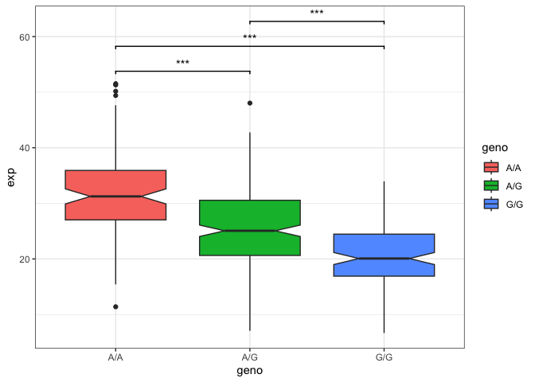

# Class12
Yuxuan Jiang A17324184

- [Section1.](#section1)
- [Section4 Population Scale
  Analysis](#section4-population-scale-analysis)

## Section1.

\###Proportion of the Mexican Ancestry in Los Angeles sample population
(MXL) are homozygous for the asthma associated SNP (G\|G)

``` r
mxl <- read.csv("373531-SampleGenotypes-Homo_sapiens_Variation_Sample_rs8067378.csv")
head(mxl)
```

      Sample..Male.Female.Unknown. Genotype..forward.strand. Population.s. Father
    1                  NA19648 (F)                       A|A ALL, AMR, MXL      -
    2                  NA19649 (M)                       G|G ALL, AMR, MXL      -
    3                  NA19651 (F)                       A|A ALL, AMR, MXL      -
    4                  NA19652 (M)                       G|G ALL, AMR, MXL      -
    5                  NA19654 (F)                       G|G ALL, AMR, MXL      -
    6                  NA19655 (M)                       A|G ALL, AMR, MXL      -
      Mother
    1      -
    2      -
    3      -
    4      -
    5      -
    6      -

``` r
table(mxl$Genotype..forward.strand.)
```


    A|A A|G G|A G|G 
     22  21  12   9 

``` r
table(mxl$Genotype..forward.strand.)/nrow(mxl)*100
```


        A|A     A|G     G|A     G|G 
    34.3750 32.8125 18.7500 14.0625 

## Section4 Population Scale Analysis

> Q13:Read this file into R and determine the sample size for each
> genotype and their corresponding median expression levels for each of
> these genotypes.

Read the data:

``` r
expr <- read.table("rs8067378_ENSG00000172057.6.txt")
head(expr)
```

       sample geno      exp
    1 HG00367  A/G 28.96038
    2 NA20768  A/G 20.24449
    3 HG00361  A/A 31.32628
    4 HG00135  A/A 34.11169
    5 NA18870  G/G 18.25141
    6 NA11993  A/A 32.89721

Total sample size

``` r
nrow(expr)
```

    [1] 462

Sample size of each genotype:

``` r
table(expr$geno)
```


    A/A A/G G/G 
    108 233 121 

Median expression levels of each genotype:

``` r
tapply(expr$exp,expr$geno,median)
```

         A/A      A/G      G/G 
    31.24847 25.06486 20.07363 

> Q14:Generate a boxplot with a box per genotype, what could you infer
> from the relative expression value between A/A and G/G displayed in
> this plot? Does the SNP effect the expression of ORMDL3?

Box-plot:

``` r
library(ggplot2)
library(ggsignif)
ggplot(expr)+
  aes(geno,exp,fill=geno)+
  geom_boxplot(notch=T)+
  geom_signif(comparisons=list(c("A/A", "A/G"), c("A/A", "G/G"), 
                               c("A/G", "G/G")),
              map_signif_level = TRUE,tip_length = 0.01,step_increase = 0.1)+ 
  theme_bw()
```



According to the analysis, samples with A/A genotype show a
significantly higher expression of ORMDL3 compared to samples with G/G
or A/G genotype. Therefore, the SNP genotype does effect the expression
of ORMDL3.
