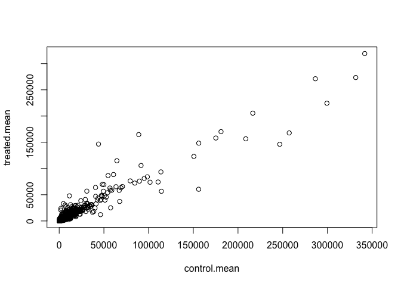
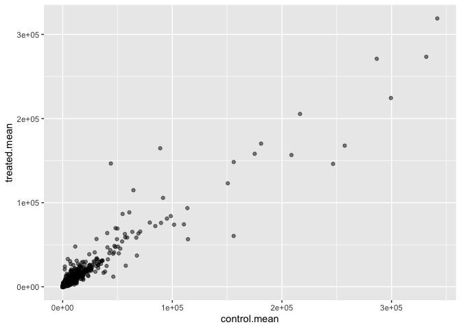
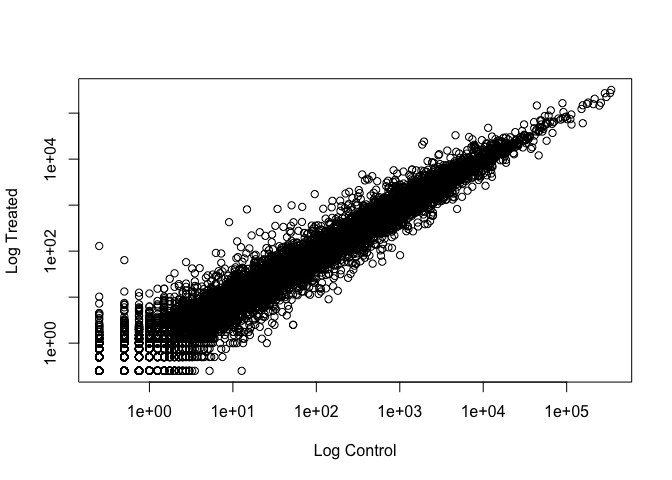
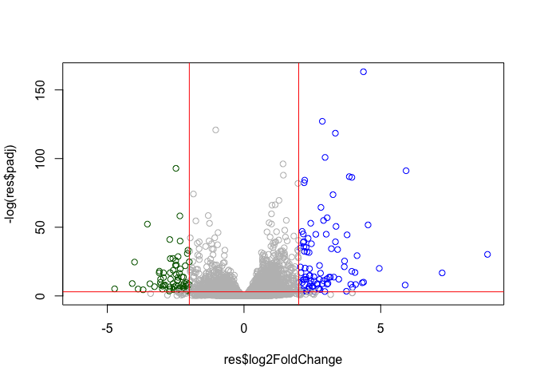
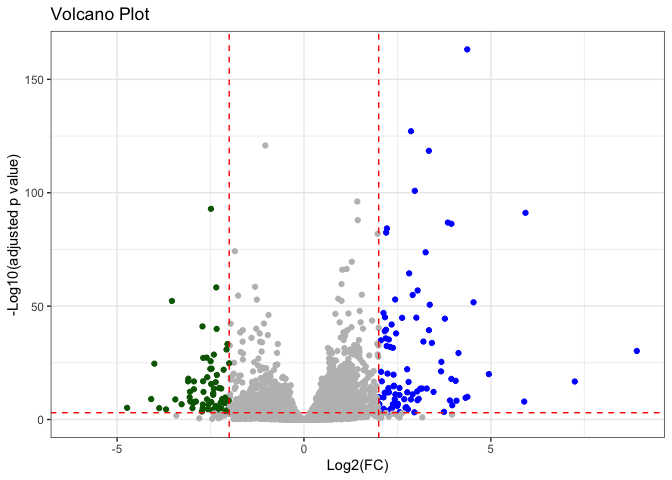

# Class13
Yuxuan Jiang A17324184

- [Background](#background)
- [Data Import](#data-import)
- [Toy differential gene expression](#toy-differential-gene-expression)
  - [Excluding `NaN` & `-inf`](#excluding-nan---inf)
- [DESeq analysis](#deseq-analysis)
  - [Run the DESeq analysis pipeline](#run-the-deseq-analysis-pipeline)
- [Volcano Plot](#volcano-plot)
  - [Adding some color annotation](#adding-some-color-annotation)
- [Save my results](#save-my-results)
- [Add annotation data](#add-annotation-data)
- [Save annotated results to a CSV
  file.](#save-annotated-results-to-a-csv-file)
- [Pathway analysis](#pathway-analysis)

## Background

Today we will perform on RNASeq analysis of the effects of a common
steroid on airway cells.

In particular, dexamethasone (“dex”) on different airway smooth muscle
cell lines (ASM cells).

## Data Import

Two different inputs:countData & colData. - **countData**: with genes in
rows and experiments in columns - **colData**:with information about the
samples

``` r
counts <- read.csv("airway_scaledcounts.csv", row.names=1)
metadata <- read.csv("airway_metadata.csv")
```

``` r
head(counts)
```

                    SRR1039508 SRR1039509 SRR1039512 SRR1039513 SRR1039516
    ENSG00000000003        723        486        904        445       1170
    ENSG00000000005          0          0          0          0          0
    ENSG00000000419        467        523        616        371        582
    ENSG00000000457        347        258        364        237        318
    ENSG00000000460         96         81         73         66        118
    ENSG00000000938          0          0          1          0          2
                    SRR1039517 SRR1039520 SRR1039521
    ENSG00000000003       1097        806        604
    ENSG00000000005          0          0          0
    ENSG00000000419        781        417        509
    ENSG00000000457        447        330        324
    ENSG00000000460         94        102         74
    ENSG00000000938          0          0          0

``` r
head(metadata)
```

              id     dex celltype     geo_id
    1 SRR1039508 control   N61311 GSM1275862
    2 SRR1039509 treated   N61311 GSM1275863
    3 SRR1039512 control  N052611 GSM1275866
    4 SRR1039513 treated  N052611 GSM1275867
    5 SRR1039516 control  N080611 GSM1275870
    6 SRR1039517 treated  N080611 GSM1275871

> Q1.How many genes are in this dataset?

``` r
nrow(counts)
```

    [1] 38694

> Q2.How many ‘control’ cell lines do we have?

``` r
sum(metadata$dex=='control')
```

    [1] 4

## Toy differential gene expression

> Q3.How would you make the above code in either approach more robust?
> Is there a function that could help here?

Use the function `rowSums`

> Q4. Follow the same procedure for the treated samples (i.e. calculate
> the mean per gene across drug treated samples and assign to a labeled
> vector called treated.mean)

We have 4 replicate drug treated and control (no drug)
columns/experiments in our `counts` object.

We want one “mean” for each gene (rows) in “treated” (drug) and one mean
value for each gene in “control”/“treated” columns

Step1:find all control/treated columns.

``` r
control.inds <- metadata$dex=='control'
treated.inds <- metadata$dex=='treated'
```

Step2:Extract them to a new object called
`control.counts`/`treated.counts`.

``` r
control.counts <- counts[,control.inds]
treated.counts <- counts[,treated.inds]
```

Step3:Then calculate the mean value for each gene.

``` r
control.mean <- rowMeans(control.counts)
treated.mean <- rowMeans(treated.counts)
```

> Q5 (a). Create a scatter plot showing the mean of the treated samples
> against the mean of the control samples. Your plot should look
> something like the following.

``` r
meancounts <- data.frame(control.mean,treated.mean)
plot(meancounts)
```



> Q5 (b).You could also use the ggplot2 package to make this figure
> producing the plot below. What geom\_?() function would you use for
> this plot?

``` r
library(ggplot2)
ggplot(meancounts)+
  aes(control.mean,treated.mean)+
  geom_point(alpha=0.5)
```



> Q6. Try plotting both axes on a log scale. What is the argument to
> plot() that allows you to do this?

``` r
plot(meancounts,log='xy',xlab='Log Control', ylab='Log Treated')
```

    Warning in xy.coords(x, y, xlabel, ylabel, log): 15032 x values <= 0 omitted
    from logarithmic plot

    Warning in xy.coords(x, y, xlabel, ylabel, log): 15281 y values <= 0 omitted
    from logarithmic plot



We often use log2 for this type of data as it makes the interpretation
much more straightforward.

Treated/control is often called “fold-change(fc)”.

If there was no change:log2-fc of 0:

``` r
log2(10/10)
```

    [1] 0

If we had double as much transcript around we would have a log2-fc of 1:

``` r
log2(20/10)
```

    [1] 1

If we had half as much transcript around we would have a log2-fc of -1:

``` r
log2(5/10)
```

    [1] -1

> Q. Calculate a log2 fold change value for al our genes and add it as a
> new column to our `meancounts` object.

``` r
meancounts$log2fc <- log2(meancounts$treated.mean/
                          meancounts$control.mean)
head(meancounts)
```

                    control.mean treated.mean      log2fc
    ENSG00000000003       900.75       658.00 -0.45303916
    ENSG00000000005         0.00         0.00         NaN
    ENSG00000000419       520.50       546.00  0.06900279
    ENSG00000000457       339.75       316.50 -0.10226805
    ENSG00000000460        97.25        78.75 -0.30441833
    ENSG00000000938         0.75         0.00        -Inf

### Excluding `NaN` & `-inf`

``` r
zero.vals <- which(meancounts[,1:2]==0, arr.ind=TRUE)
head(zero.vals)
```

                    row col
    ENSG00000000005   2   1
    ENSG00000004848  65   1
    ENSG00000004948  70   1
    ENSG00000005001  73   1
    ENSG00000006059 121   1
    ENSG00000006071 123   1

``` r
to.rm <- unique(zero.vals[,1])
mycounts <- meancounts[-to.rm,]
head(mycounts)
```

                    control.mean treated.mean      log2fc
    ENSG00000000003       900.75       658.00 -0.45303916
    ENSG00000000419       520.50       546.00  0.06900279
    ENSG00000000457       339.75       316.50 -0.10226805
    ENSG00000000460        97.25        78.75 -0.30441833
    ENSG00000000971      5219.00      6687.50  0.35769358
    ENSG00000001036      2327.00      1785.75 -0.38194109

> Q7. What is the purpose of the arr.ind argument in the which()
> function call above? Why would we then take the first column of the
> output and need to call the unique() function?

`arr.ind` allows the `which` function to return both the row and column
coordinates of the position of each `TRUE` value. Hence, we know exactly
which value (control.mean or treated.mean) of which gene is 0.

We then take the first column of the output as it’s the the row numbers
of genes with 0 values. And we want to get rid of those genes.

We use `unique` so even when both control.mean and treated.mean are 0
for a gene, that gene is only removed once.

> Q8. Using the up.ind vector above can you determine how many up
> regulated genes we have at the greater than 2 fc level?

``` r
up.ind <- mycounts$log2fc > 2
sum(up.ind)
```

    [1] 250

> Q9. Using the down.ind vector above can you determine how many down
> regulated genes we have at the greater than 2 fc level?

``` r
down.ind <- mycounts$log2fc < (-2)
sum(down.ind)
```

    [1] 367

> Q10. Do you trust these results? Why or why not?

Not really. Since without a p-value, we can’t really tell whether the
difference are statistically significant or not.

## DESeq analysis

Let’s do this analysis with an estimate of statistical significance
using the **DESeq**.

**DESeq** want it’s input data in a very specific way.

``` r
library(DESeq2)
dds <- DESeqDataSetFromMatrix(countData = counts,
                              colData = metadata,
                              design = ~dex)
```

    Warning in DESeqDataSet(se, design = design, ignoreRank): some variables in
    design formula are characters, converting to factors

### Run the DESeq analysis pipeline

The main function `DESeq()`

``` r
dds <- DESeq(dds)
```

    estimating size factors

    estimating dispersions

    gene-wise dispersion estimates

    mean-dispersion relationship

    final dispersion estimates

    fitting model and testing

``` r
res <- results(dds)
head(res)
```

    log2 fold change (MLE): dex treated vs control 
    Wald test p-value: dex treated vs control 
    DataFrame with 6 rows and 6 columns
                      baseMean log2FoldChange     lfcSE      stat    pvalue
                     <numeric>      <numeric> <numeric> <numeric> <numeric>
    ENSG00000000003 747.194195      -0.350703  0.168242 -2.084514 0.0371134
    ENSG00000000005   0.000000             NA        NA        NA        NA
    ENSG00000000419 520.134160       0.206107  0.101042  2.039828 0.0413675
    ENSG00000000457 322.664844       0.024527  0.145134  0.168996 0.8658000
    ENSG00000000460  87.682625      -0.147143  0.256995 -0.572550 0.5669497
    ENSG00000000938   0.319167      -1.732289  3.493601 -0.495846 0.6200029
                         padj
                    <numeric>
    ENSG00000000003  0.163017
    ENSG00000000005        NA
    ENSG00000000419  0.175937
    ENSG00000000457  0.961682
    ENSG00000000460  0.815805
    ENSG00000000938        NA

## Volcano Plot

A main summary results figure from these kinds of studies. It is a plot
if Log2-fc vs Adjusted P-value.

``` r
plot(res$log2FoldChange,res$padj)
```


Log transforming on the y axis:

``` r
plot(res$log2FoldChange,-log(res$padj))
abline(v=-2,col='red')
abline(v=2,col='red')
abline(h=-log(0.05),col='red')
```


``` r
plot(res$log2FoldChange,-log(res$padj))
```


### Adding some color annotation

``` r
mycols <- rep("gray",nrow(res))
mycols[res$log2FoldChange > 2] <- 'blue'
mycols[res$log2FoldChange< -2] <- 'darkgreen'
mycols[res$padj >= 0.05] <- 'gray'
plot(res$log2FoldChange,-log(res$padj), col=mycols)
abline(v=-2,col='red')
abline(v=2,col='red')
abline(h=-log(0.05),col='red')
```



> Q.ggplot version

``` r
mycols <- rep("gray",nrow(res))
mycols[res$log2FoldChange > 2] <- 'blue'
mycols[res$log2FoldChange< -2] <- 'darkgreen'
mycols[res$padj >= 0.05] <- 'grey'
library(ggplot2)
ggplot(res)+
  aes(res$log2FoldChange,-log(res$padj))+
  geom_point(col=mycols)+
  geom_vline(xintercept = -2,linetype='dashed',col='red')+
  geom_vline(xintercept = 2,linetype='dashed',col='red')+
  geom_hline(yintercept = -log(0.05),linetype='dashed',col='red')+
  labs(x='Log2(FC)',y='-Log10(adjusted p value)',title="Volcano Plot")+
  theme_bw()
```

    Warning: Removed 23549 rows containing missing values or values outside the scale range
    (`geom_point()`).



## Save my results

Write a CSV file:

``` r
write.csv(res,file = "results.csv")
```

## Add annotation data

We need to add missing annotation data to our main `res` results object.
This includes the common gene “symbol”. We will use R and bioconductor
to do this “ID mapping”.

``` r
library("AnnotationDbi")
library("org.Hs.eg.db")
```

``` r
columns(org.Hs.eg.db)
```

     [1] "ACCNUM"       "ALIAS"        "ENSEMBL"      "ENSEMBLPROT"  "ENSEMBLTRANS"
     [6] "ENTREZID"     "ENZYME"       "EVIDENCE"     "EVIDENCEALL"  "GENENAME"    
    [11] "GENETYPE"     "GO"           "GOALL"        "IPI"          "MAP"         
    [16] "OMIM"         "ONTOLOGY"     "ONTOLOGYALL"  "PATH"         "PFAM"        
    [21] "PMID"         "PROSITE"      "REFSEQ"       "SYMBOL"       "UCSCKG"      
    [26] "UNIPROT"     

We can use the `mapIds()` function now to translate between any of these
databases.

``` r
res$symbol <- mapIds(org.Hs.eg.db,
                     keys=row.names(res),
                     keytype = "ENSEMBL",
                     column = "SYMBOL",
                     multiVals = "first")
```

    'select()' returned 1:many mapping between keys and columns

> Q.Also add “ENTREZID”,“GENENAME”.

``` r
res$entrezid <- mapIds(org.Hs.eg.db,
                     keys=row.names(res),
                     keytype = "ENSEMBL",
                     column = "ENTREZID",
                     multiVals = "first")
```

    'select()' returned 1:many mapping between keys and columns

``` r
res$genename <- mapIds(org.Hs.eg.db,
                     keys=row.names(res),
                     keytype = "ENSEMBL",
                     column = "GENENAME",
                     multiVals = "first")
```

    'select()' returned 1:many mapping between keys and columns

``` r
head(res)
```

    log2 fold change (MLE): dex treated vs control 
    Wald test p-value: dex treated vs control 
    DataFrame with 6 rows and 9 columns
                      baseMean log2FoldChange     lfcSE      stat    pvalue
                     <numeric>      <numeric> <numeric> <numeric> <numeric>
    ENSG00000000003 747.194195      -0.350703  0.168242 -2.084514 0.0371134
    ENSG00000000005   0.000000             NA        NA        NA        NA
    ENSG00000000419 520.134160       0.206107  0.101042  2.039828 0.0413675
    ENSG00000000457 322.664844       0.024527  0.145134  0.168996 0.8658000
    ENSG00000000460  87.682625      -0.147143  0.256995 -0.572550 0.5669497
    ENSG00000000938   0.319167      -1.732289  3.493601 -0.495846 0.6200029
                         padj      symbol    entrezid               genename
                    <numeric> <character> <character>            <character>
    ENSG00000000003  0.163017      TSPAN6        7105          tetraspanin 6
    ENSG00000000005        NA        TNMD       64102            tenomodulin
    ENSG00000000419  0.175937        DPM1        8813 dolichyl-phosphate m..
    ENSG00000000457  0.961682       SCYL3       57147 SCY1 like pseudokina..
    ENSG00000000460  0.815805       FIRRM       55732 FIGNL1 interacting r..
    ENSG00000000938        NA         FGR        2268 FGR proto-oncogene, ..

## Save annotated results to a CSV file.

``` r
write.csv(res,file="results_annotated.csv")
```

## Pathway analysis

What known biological pathway do our differentially expressed genes
overlap with (i.e. play a role in)?

There’s lots of bioconductor packages to do this type of analysis.

We will use one of the oldest called **gage** along with **pathview** to
render nice pics of the pathways we
find:`BiocManager::install( c("pathview", "gage", "gageData") )`

Have a peak what is in`gageData`:

``` r
library(pathview)
library(gage)
library(gageData)
data(kegg.sets.hs)
head(kegg.sets.hs, 2)
```

    $`hsa00232 Caffeine metabolism`
    [1] "10"   "1544" "1548" "1549" "1553" "7498" "9"   

    $`hsa00983 Drug metabolism - other enzymes`
     [1] "10"     "1066"   "10720"  "10941"  "151531" "1548"   "1549"   "1551"  
     [9] "1553"   "1576"   "1577"   "1806"   "1807"   "1890"   "221223" "2990"  
    [17] "3251"   "3614"   "3615"   "3704"   "51733"  "54490"  "54575"  "54576" 
    [25] "54577"  "54578"  "54579"  "54600"  "54657"  "54658"  "54659"  "54963" 
    [33] "574537" "64816"  "7083"   "7084"   "7172"   "7363"   "7364"   "7365"  
    [41] "7366"   "7367"   "7371"   "7372"   "7378"   "7498"   "79799"  "83549" 
    [49] "8824"   "8833"   "9"      "978"   

The main `gage()` function does the work wants a simple vector as input.
The KEGG database uses ENTREZ ids so we need to provide thses in our
input vector for **gage**:

``` r
foldchanges <- res$log2FoldChange
names(foldchanges) <- res$entrezid
head(foldchanges)
```

           7105       64102        8813       57147       55732        2268 
    -0.35070296          NA  0.20610728  0.02452701 -0.14714263 -1.73228897 

We can run `gage` and see what is in the output object `keggres`:

``` r
keggres = gage(foldchanges, gsets=kegg.sets.hs)
attributes(keggres)
```

    $names
    [1] "greater" "less"    "stats"  

The first few down (less) pathway results:

``` r
head(keggres$less, 3)
```

                                          p.geomean stat.mean        p.val
    hsa05332 Graft-versus-host disease 0.0004250607 -3.473335 0.0004250607
    hsa04940 Type I diabetes mellitus  0.0017820379 -3.002350 0.0017820379
    hsa05310 Asthma                    0.0020046180 -3.009045 0.0020046180
                                            q.val set.size         exp1
    hsa05332 Graft-versus-host disease 0.09053792       40 0.0004250607
    hsa04940 Type I diabetes mellitus  0.14232788       42 0.0017820379
    hsa05310 Asthma                    0.14232788       29 0.0020046180

We can use the **pathview** function to render a figure of any of these
pathways along with annotation for our DEGS.

The hsa05310 Asthma pathway with our DEGs colored up:

``` r
pathview(gene.data=foldchanges, pathway.id="hsa05310")
```


> Q. Can you render and insert here the pathway figures for
> Graft-versus-host disease and Type I diabetes mellitus?

``` r
pathview(gene.data=foldchanges,pathway.id = "hsa05332")
```


``` r
pathview(gene.data=foldchanges,pathway.id = "hsa04940")
```


