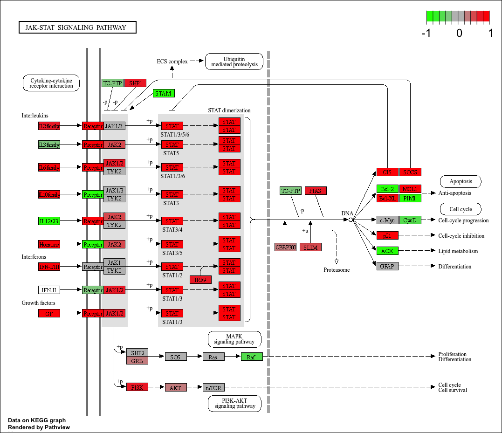
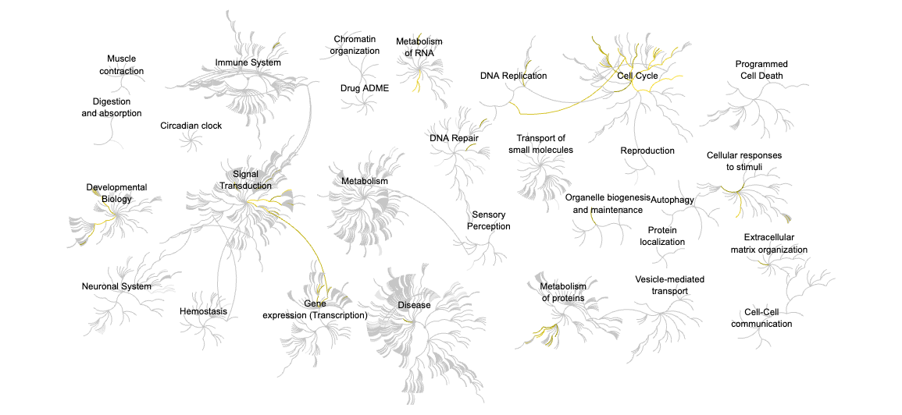

## Section 1. Differential Expression Analysis

```{r,message=FALSE}
library(DESeq2)
colData <- read.csv("GSE37704_metadata.csv", row.names=1)
countData <- read.csv("GSE37704_featurecounts.csv", row.names=1)
head(colData)
head(countData)
```
>Q. Complete the code below to remove the troublesome first column from countData:

```{r}
countData <- as.matrix(countData[,-1])
head(countData)
```
>Q. Complete the code below to filter countData to exclude genes (i.e. rows) where we have 0 read count across all samples (i.e. columns).

```{r}
countData = countData[rowSums(countData)!=0,]
head(countData)
```
### Running DESeq2

```{r}
dds = DESeqDataSetFromMatrix(countData=countData,
                             colData=colData,
                             design=~condition)
dds = DESeq(dds)
dds
```
```{r}
res = results(dds)
```
>Q. Call the summary() function on your results to get a sense of how many genes are up or down-regulated at the default 0.1 p-value cutoff.

```{r}
summary(res)
```
### Volcano Plot

```{r}
library(ggplot2)
ggplot(res) +
  aes(res$log2FoldChange,
      -log(res$padj)) +
  geom_point()
```
>Q. Improve this plot by completing the below code, which adds color, axis labels and cutoff lines:

```{r}
mycols <- rep("gray", nrow(res))
mycols[ abs(res$log2FoldChange) > 2 ] <- "blue"
mycols[ res$padj > 0.01 ] <- "gray"
library(ggplot2)
ggplot(res) +
  aes(res$log2FoldChange,-log(res$padj)) +
  geom_point(col=mycols)+
  geom_vline(xintercept = 2,linetype="dashed",col="black")+
  geom_vline(xintercept = -2,linetype="dashed",col="black")+
  geom_hline(yintercept = -log(0.05),linetype="dashed",col="black")+
  xlab("Log2(FoldChange)") +
  ylab("-Log(P-value)")
```
>Q. Use the mapIDs() function multiple times to add SYMBOL, ENTREZID and GENENAME annotation to our results by completing the code below.

```{r}
library("AnnotationDbi")
library("org.Hs.eg.db")

columns(org.Hs.eg.db)

res$symbol = mapIds(org.Hs.eg.db,
                    keys=row.names(res), 
                    keytype="ENSEMBL",
                    column="SYMBOL",
                    multiVals="first")

res$entrez = mapIds(org.Hs.eg.db,
                    keys=row.names(res),
                    keytype="ENSEMBL",
                    column="ENTREZID",
                    multiVals="first")

res$name =   mapIds(org.Hs.eg.db,
                    keys=row.names(res),
                    keytype="ENSEMBL",
                    column="GENENAME",
                    multiVals="first")

head(res, 10)
```
>Q. Finally for this section let's reorder these results by adjusted p-value and save them to a CSV file in your current project directory.

```{r}
res = res[order(res$pvalue),]
write.csv(res, file="deseq_results.csv")
```

## Section 2. Pathway Analysis

```{r,message=FALSE}
library(pathview)
library(gage)
library(gageData)
data(kegg.sets.hs)
data(sigmet.idx.hs)
kegg.sets.hs = kegg.sets.hs[sigmet.idx.hs]
head(kegg.sets.hs, 3)
```
```{r}
foldchanges = res$log2FoldChange
names(foldchanges) = res$entrez
head(foldchanges)
keggres = gage(foldchanges, gsets=kegg.sets.hs)
attributes(keggres)
```
The first few down (less) pathway results:
```{r}
head(keggres$less)
```
```{r,message=FALSE}
pathview(gene.data=foldchanges, pathway.id="hsa04110")
```


```{r,message=FALSE}
keggrespathways <- rownames(keggres$greater)[1:5]
keggresids = substr(keggrespathways, start=1, stop=8)
keggresids
keggrespathways
pathview(gene.data=foldchanges, pathway.id=keggresids, species="hsa")
```





>Q. Can you do the same procedure as above to plot the pathview figures for the top 5 down-regulated pathways?

```{r,message=FALSE}
keggrespathwaysdown <- rownames(keggres$less)[1:5]
keggresidsdown = substr(keggrespathwaysdown, start=1, stop=8)
keggresidsdown
keggrespathwaysdown
pathview(gene.data=foldchanges, pathway.id=keggresidsdown, species="hsa")
```


## Section 3. Gene Ontology (GO)

```{r}
data(go.sets.hs)
data(go.subs.hs)
gobpsets = go.sets.hs[go.subs.hs$BP]
gobpres = gage(foldchanges, gsets=gobpsets)
lapply(gobpres, head)
```
## Section 4. Reactome Analysis

The list of significant genes at the 0.05 level as a plain text file:
```{r}
sig_genes <- res[res$padj <= 0.05 & !is.na(res$padj), "symbol"]
print(paste("Total number of significant genes:", length(sig_genes)))
```
```{r}
write.table(sig_genes, file="significant_genes.txt", row.names=FALSE, col.names=FALSE, quote=FALSE)
```

>Q: What pathway has the most significant “Entities p-value”? Do the most significant pathways listed match your previous KEGG results? What factors could cause differences between the two methods?

Cell Cycle, Mitotic has the most significant Entities p-value (p=2.1E-5). Cell Cycle, Mitotic is not listed in the previous KEGG results. The differences may mainly come from the distinct database different methods used. Besides, it may also comes from how different methods define each pathways. For instance, some pathways that is considered an independent pathway in one method may be included into a more general biological process in another method.